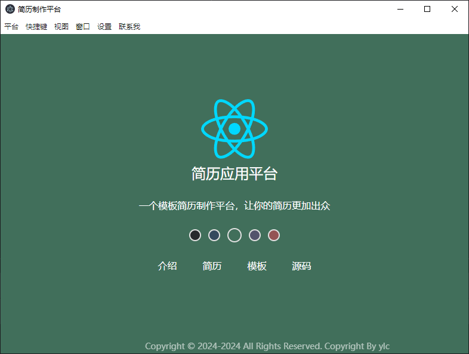
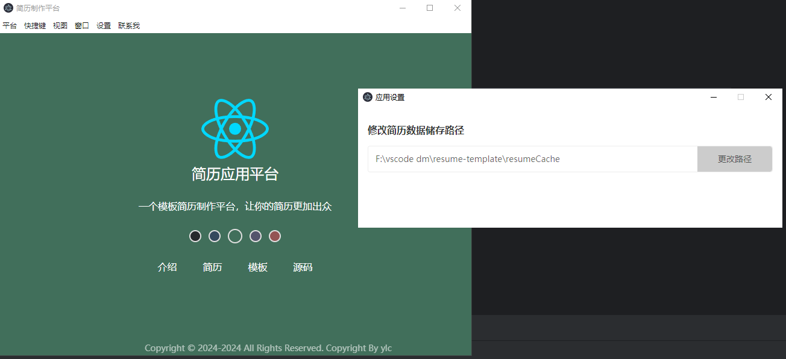
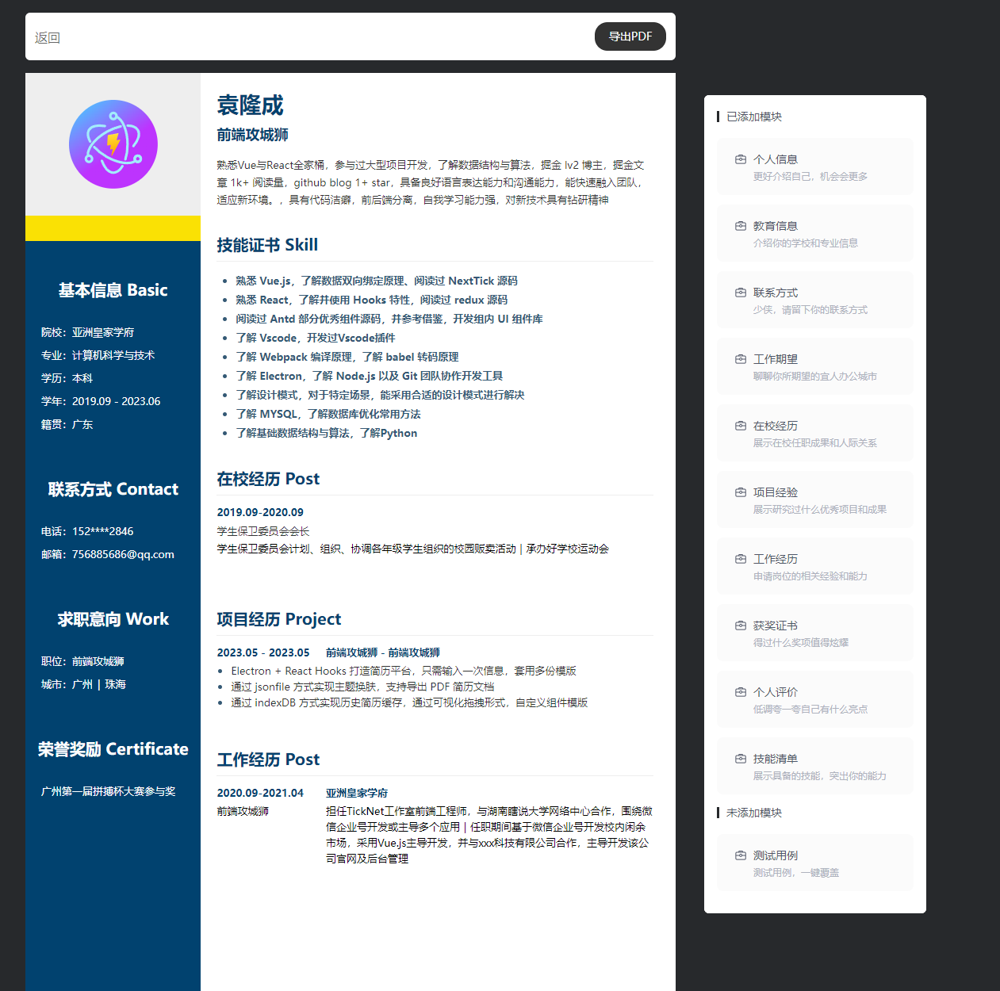
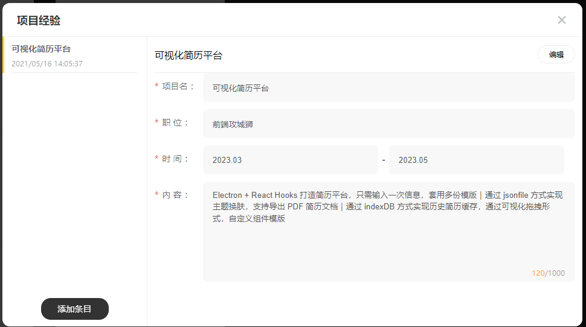

# React + Electron + Vite

## 介绍
### 基于electron和react的简历模板应用，可基于简历模板快速生成简历，并导出为pdf。

## 使用方法
### 执行
- pnpm i 
- pnpm run dev

## 功能介绍
- 弹窗交互录入各项简历信息
- 信息存储本地
- 自定义存储路径
- 多种简历模板可选择
- 切换模板后简历信息自动带入
- 简历可导出生成pdf

## 部分截图

